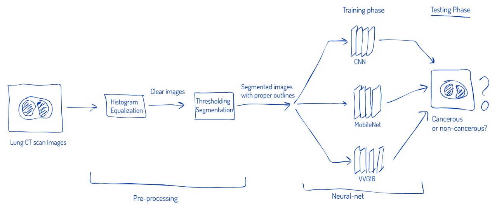

Lung Cancer Detection
A Novel Pipeline for Early-Stage Detection of Lung Cancer from Computer Tomography (CT) Scan Images

Abstract
Lung cancer remains one of the most life-threatening diseases worldwide and is the second leading cause of death among all cancers. It affects both men and women at alarming rates, with approximately five million deaths annually on a global scale. In the United States alone, more than 200,000 new cases are diagnosed each year. Early detection plays a critical role in improving patient survival rates; however, diagnosing lung cancer at its initial stage is highly challenging due to several factors:

Complexity of CT Scan Data – CT images contain large volumes of high-resolution data, making manual inspection time-consuming and prone to oversight.

Blurred Nodule Boundaries – Tumors often exhibit low contrast and irregular shapes, which makes segmentation difficult.

Small Nodule Size & Hidden Locations – Early-stage nodules can be extremely small or positioned in complex anatomical regions, leading to missed diagnoses.

Manual Diagnosis Limitations – Human interpretation of medical images, especially MRI or CT scans, is subject to fatigue, variability, and potential error.

To address these challenges, Machine Learning (ML) and Deep Learning (DL) techniques have emerged as powerful tools in medical image analysis. By leveraging convolutional neural networks (CNNs) and advanced image preprocessing, these methods can automatically identify and classify lung nodules with high accuracy, reducing diagnosis time and improving consistency.

In this research, we propose a novel automated pipeline for lung cancer detection from CT scan images. The proposed method integrates:

Image Preprocessing – Enhancing contrast, reducing noise, and normalizing images for consistent analysis.

Segmentation – Isolating lung regions and identifying suspicious nodules using advanced segmentation algorithms.

Feature Extraction & Classification – Employing deep learning architectures to extract discriminative features and classify nodules as benign or malignant.

Prediction & Decision Support – Generating accurate diagnostic outputs to assist radiologists in making informed decisions.

The primary objectives of this work are to:

Improve the accuracy of early-stage lung cancer detection.

Reduce the time and effort required for manual diagnosis.

Provide a reliable, reproducible, and scalable solution for clinical use.

This approach aims to outperform traditional diagnostic methods and existing automated solutions, offering a fast, robust, and efficient detection system that could significantly impact patient outcomes.

